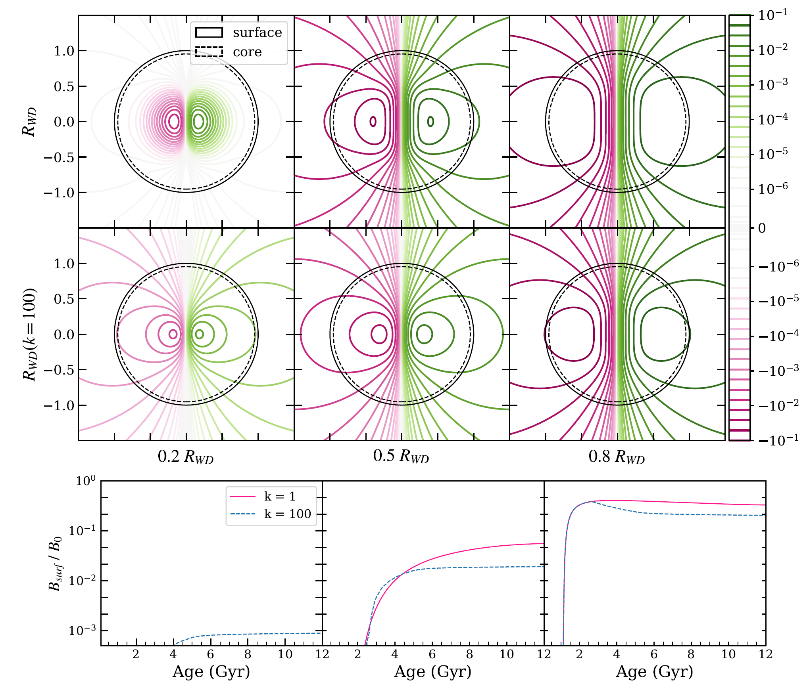

# Numerical Simulation Tool for Evolution of Magnetic Field

White dwarfs, the remnant of low-mass stars’ death, are compact small stellar objects, that slowly
dissipate their thermal energy. They last for over 10 billion years before completely crystallizing.
They are also commonly observed to be strongly magnetized. The origin of this strong magnetic
field has always been mysterious. Several studies reveal a possible explanation: white dwarf’s core
crystallization imposes compositional convection, which, further combined with stellar rotation,
could drive a dynamo, in analogy to Earth’s core dynamo. In the past, this process was believed to
be insufficient to support the large intensity of the observed magnetic field. A recent study, in
which the author combines mixing-length theory with scalings from magnetorotational convection,
shows possible higher convection velocity, sufficiently supporting observation with an estimation
of field strength $\sim 10^6$ − $10^8 G$. However, this is the strength of the initial magnetic field which
starts only in the convection zone. After several billion years, the star cools down, and such a
field diffuses and reveals itself at the star’s surface. A loss in magnetic energy during the diffusion
will reduce the field intensity. With numerical calculation, we found that for an initial field size of
∼ 0.2RWD −0.8RWD, the intensity of the surface field is $\sim 10^{−4}$ − $10^{−1}$ of the original. This result
is consistent with observations, making the core-convection mechanism a stronger argument.

One way to simulate the evolution of white dwarf's magnetic field, in a small scale calculation, 
is to employ a simple model which assumes that the field is spherical symmetrical. Then the 3D induction equation 
$$ \frac{\partial \vec{B}}{\partial t} = - \nabla \times (\eta \nabala \times \vec{B})$$
can be reduced to a modified 1D radial equation, if the diffusivity profile is only function of position $\eta(r)$
$$ \frac{\partial R_l}{\partial t} = \eta(r) \left[ \frac{\partial^2 R_l}{\partial r^2} - \frac{l(l+1)R_l}{r^2} \right] $$
Which is a simple diffusion equation with a modification term. This form is easily solvable by matrix operation. 
Please refer to [code](https://github.com/ShuZ3274/White-Dwarf/blob/main/Numerical%20Model%20of%20White%20Dwarf%20%E2%80%99s%20Magnetic%20Field%20Evolution/methods.py)
on Github for methods in details.

In the limit of first mode magnetic field (dipole) only, assumming some composition (details in this [paper](https://arxiv.org/abs/2406.01807)),
the field could be caculated for a later time. It turns out that the maximum of field strength is roughly $10\%$ of what started with.
Here is an interesting figure from this paper showing different initial magnetic field sizes and their end stage:

Full text of the paper and the code are avaliable on [GitHub](https://github.com/ShuZ3274/White-Dwarf)